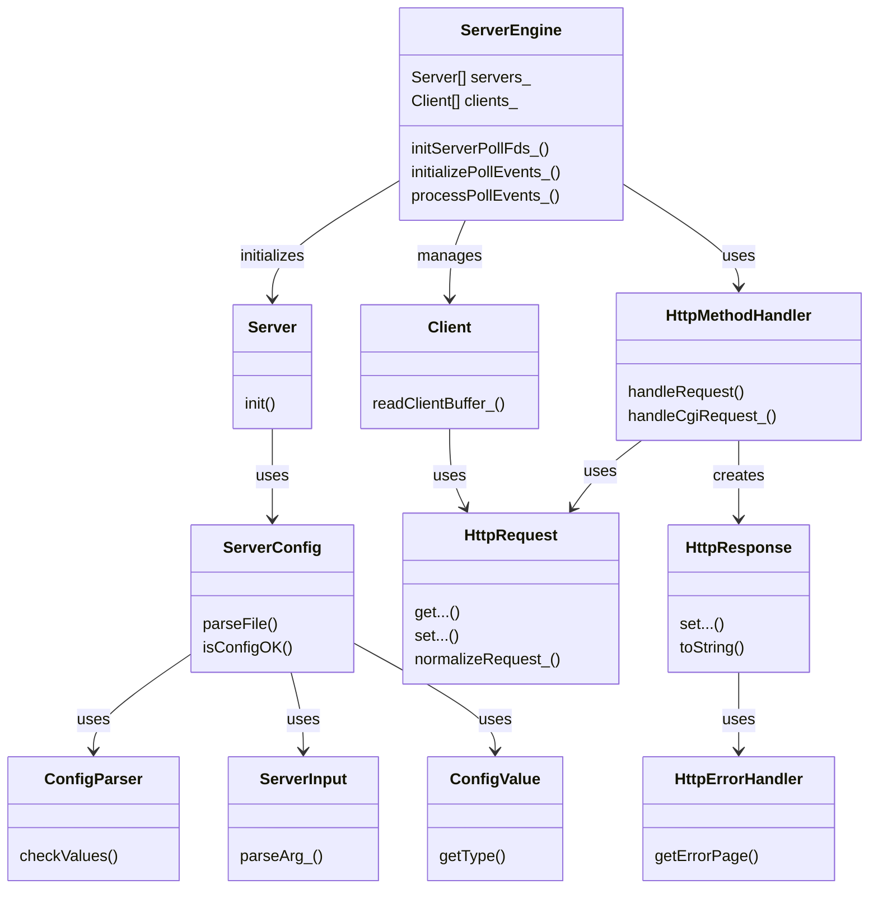

# Webserv

This is our solution for the Webserv project of [42 School Berlin](https://42berlin.de/de/).

👥 Team: [Manuel Migoya](https://github.com/migmanu/), [Sebastian Navarro](https://github.com/SebasNadu/), and [Deniz Özdemir](https://github.com/deniz-oezdemir).

⏳ Timeline: 1.5 months.

🏅 Grade:

## Table of Contents
## Table of Contents
- [Summary](#summary)
  - [Basic Requirements](#basic-requirements)
  - [Bonus 🎉](#bonus-)
  - [Extras ✨](#extras-)
- [Demonstration](#demonstration)
- [Class Diagram](#class-diagram)
- [Usage 🚀](#usage-)
  - [Flags](#flags)
  - [Execute Tests 🧪](#execute-tests-)
- [Configuration File 🛠️](#configuration-file-)
  - [General Directives](#general-directives)
  - [General Server Directives](#general-server-directives)
  - [Location-Specific Directives](#location-specific-directives)
- [Simple Testing 🔍](#simple-testing-)
- [Stress Testing 🏋️](#stress-testing-)
- [Sources](#sources)
  - [General](#general)
  - [Repositories](#repositories)

## Summary

### Basic Requirements
Webserv is a minimal implementation of a web server, loosely following the `nginx` approach. The [subject](en.subject.pdf) requires the server to:

- Handle multiple client requests simultaneously using non-blocking I/O operations and the `poll()` system call (or equivalent).
- Serve static websites.
- Handle CGIs.
- Manage file uploads.
- Listen on multiple ports.
- Never crash and handle all errors according to RFC standards.

### Bonus 🎉
In addition to the mandatory requirements, we implemented several bonus features to enhance our web server:

- **Cookies and Session Management:** Allows for more complex web applications requiring user state persistence.
- **Multiple CGI Scripts:** Enables dynamic content generation with languages like Python, JavaScript, and Rust.

### Extras ✨
Besides the bonus features, we added several extra functionalities:

- **Test Suite:** Utilized [Criterion](https://github.com/Snaipe/Criterion) for thorough testing. **Warning:** this does not follow the subject requirements, as it needs cpp11.
- **Custom Logger:** Implemented a detailed, level-based logging system.
- **Syntax Checks:** Added a lot more syntax checks for HTTP requests than what the subject requires.

## Demonstration

Below is a brief demonstration of our server (server no. 7 in the default config) serving the Instaclone website, which has a picture size limit of 3MB.

https://github.com/user-attachments/assets/8e807509-84c8-425f-aedf-43d13d29e03f

## Class Diagram
The following diagram illustrates the relationships and key methods of the main classes:



## Usage 🚀

In order to test our Webserv implementation, clone and make it.

```bash
git clone https://github.com/deniz-oezdemir/Webserv.git
cd Webserv
make
```
You can start by using the default config provided. This config has seven virtual servers listening on ports 8081 to 8087. We recommend starting with `http://localhost:8087/`, our humble Instagram clone.

```bash
./webserv [OPTIONAL: flags] [OPTIONAL: config_file]
```

#### Flags

| Flag          | Description                                                  |
| ------------- | ------------------------------------------------------------ |
| -h, --help    | Display help message                                         |
| -v, --version | Display WebServ version                                      |
| -V, --Version | Display WebServ version and extra info                       |
| -t, --test    | Check the configuration file and exit the server             |
| -T, --Test    | Check and print the configuration file, then exit the server |

### Execute Tests 🧪

#### Run all tests

```bash
make test
```

#### Run specific test

```bash
make test T=SpecificTestName
```

## Configuration File 🛠️

### General Directives

| Directive            | Description                                                     |
| -------------------- | --------------------------------------------------------------- |
| `error_log`          | Define the log level (debug, info, error)                       |
| `worker_processes`   | Specifies the number of worker processes.                       |
| `worker_connections` | Specifies the maximum number of connections per worker process. |

### General Server Directives

| Directive              | Description                                                                |
| ---------------------- | -------------------------------------------------------------------------- |
| `listen`               | Specifies the port and optionally the host that the server listens on.     |
| `server_name`          | Defines the server name or domain name that this server block handles.     |
| `error_page`           | Sets custom error pages for specified HTTP error codes.                    |
| `client_max_body_size` | Limits the maximum size of the client request body.                        |
| `root`                 | Defines the root directory for serving files.                              |
| `index`                | Specifies the default file to serve when a request is made to a directory. |

### Location-Specific Directives

| Directive              | Description                                                                                          |
| ---------------------- | ---------------------------------------------------------------------------------------------------- |
| `root`                 | Sets the root directory for requests matching the `location` block.                                  |
| `index`                | Specifies the default file to serve if the request is a directory.                                   |
| `limit_except`         | Restricts allowed HTTP methods for the specified location.                                           |
| `return`               | Sets up HTTP redirection for the specified location.                                                 |
| `autoindex`            | Enables or disables directory listing for the specified location.                                    |
| `client_max_body_size` | Limits the maximum size of the client request body for a specific location.                          |
| `upload_store`         | Specifies the directory where uploaded files should be saved.                                        |
| `cgi`                  | Specifies the CGI extension script and the binary path to execute. e.g., `cgi .py /usr/bin/python3`. |

## Simple Testing 🔍
The easiest way to test is going to `http://localhost:8087/` with your browser. For more rigorous tests:

`curl --resolve dog.com:8085:127.0.0.1 http://dog.com:8085/`

`curl --resolve dad.com:8086:127.0.0.1 http://dad.com:8086/`

Or use `telnet` and paste a request. There are some example requests in the `test` directory. **Remember** to include the empty line at the end.

```bash
telnet localhost 8087
```

You can test non-blocking behavior from multiple terminal clients with different messages like `yes "Example message 1" | telnet localhost 8080`

## Stress Testing 🏋️

To test the performance and measure its response under load, you use the `siege` command. Here's an example of how to use it:

```bash
siege -c 255 -t 10s http://127.00.00:8080/
```

In this command, the options `-c` and `-t` are used to specify the number of concurrent users and the duration of the test. The URL `http://127.00.00:8080/` should be replaced with the actual URL of your server.

Siege does not properly close client connections for time-based testing. But it does so when using a set number of connections:

```bash
siege -r 10 -c 255 http://127.00.00:8080/
```

## Sources

### General
1. [RFC 2616: Hypertext Transfer Protocol -- HTTP/1.1](https://datatracker.ietf.org/doc/html/rfc2616#section-9.3)
2. [42 Resources - Webserv](https://github.com/jotavare/42-resources?tab=readme-ov-file#webserv)
3. [The computerscience book, pp. 117-120: High-level explanation of the HTTP client-server model](https://drive.google.com/file/d/1KgjN7_yIHBlDb_iy_gJvuM2O8daE7wEK/view?usp=drive_link)
4. [How the web works: HTTP and CGI explained](https://www.garshol.priv.no/download/text/http-tut.html) or [with annotations](https://drive.google.com/file/d/13dUBVxbOI5nkNM-6BMJyxq4DXfEF9m-F/view?usp=drive_link)
5. [CGI by IBM](https://www.ibm.com/docs/en/i/7.5?topic=functionality-cgi)
6. [Basic CGI tutorial in C++](https://www.tutorialspoint.com/cplusplus/cpp_web_programming.htm)
7. [Tiny server written in C++](https://ncona.com/2019/04/building-a-simple-server-with-cpp/)
8. [Evaluation sheet](https://winder.nom.za/ferdaws/42/Cursus/webserv.php)
9. [Sockets and network programming in C](https://www.codequoi.com/en/sockets-and-network-programming-in-c/)
10. [Basic webserver with Rust](https://www.youtube.com/watch?v=7GBlCinu9yg&list=TLPQMjUwODIwMjRAj6F-DJ0YYA&index=5)
11. [Siege, testing tool](https://github.com/JoeDog/siege)
12. [About sockaddr_in and sockaddr with bind()](https://stackoverflow.com/questions/21099041/why-do-we-cast-sockaddr-in-to-sockaddr-when-calling-bind)
13. [About header whitespaces](https://stackoverflow.com/questions/31773667/handling-whitespaces-in-http-headers)

### Repositories
1. [Kaydooo/Webserv_42](https://github.com/Kaydooo/Webserv_42)
2. [nicolasgasco/42_webserv](https://github.com/nicolasgasco/42_webserv)
3. [mariiamakura/webserv](https://github.com/mariiamakura/webserv)

If you have any doubt about the project, or 42 in general, do not hesitate to contact us. You can do so via our emails listed in our GitHub profiles or via Slack, if you are a 42 student (denizod, jmigoya-, johnavar).
