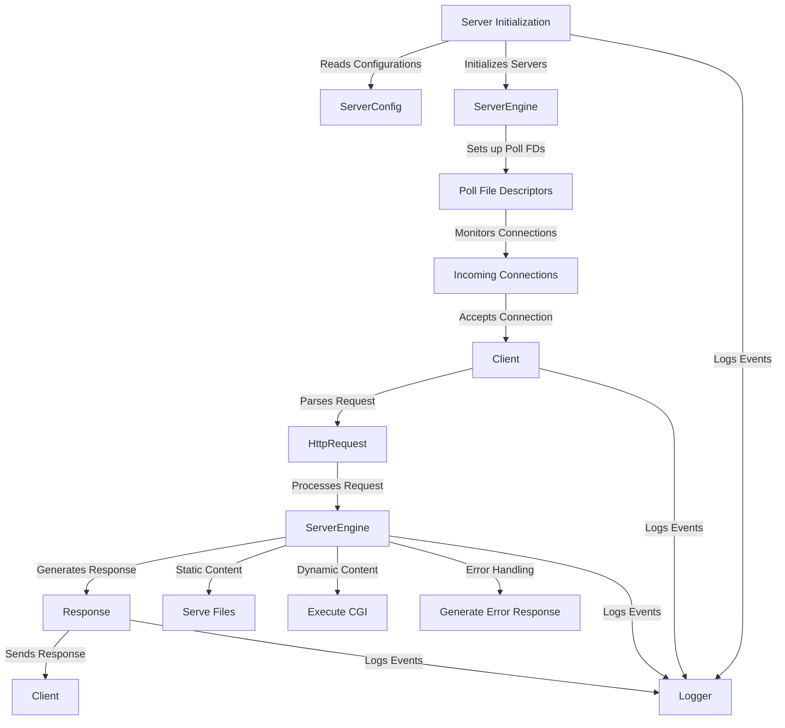

# Webserv
https://github.com/user-attachments/assets/8ecc6cc6-2315-4811-82c2-c528cd770d82

This is our solution for the Webserv project of [42 School Berlin](https://42berlin.de/de/). 

Team: [Deniz Oezemir](https://github.com/deniz-oezdemir), [Manuel Migoya](https://github.com/migmanu/) and [Sebastian Navarro](https://github.com/SebasNadu/).

Timeline: 1.5 months.

Grade:

## Summary

### Basic Requirements
Webserv is a minimal implementation of a web server, loosely following the `nginx` approach. The [subject]() requires the server to:

- Handle multiple client requests simultaneously using non-blocking I/O operations and the `poll()` system call (or equivalent).
- Serve static websites.
- Handle CGIs.
- Manage file uploads.
- Listen on multiple ports.
- Never crash and handle all errors according to RFC standards.

### Bonus
In addition to the mandatory requirements, we implemented several bonus features to enhance our web server:

- **Cookies and Session Management:** Allows for more complex web applications requiring user state persistence.
- **Multiple CGI Scripts:** Enables dynamic content generation with languages like PHP and Python.

These enhancements were rigorously tested to ensure seamless integration with the core functionalities. Overall, our project demonstrates a comprehensive understanding of HTTP server implementation and showcases our ability to extend its capabilities beyond the basics.

### Extras
Besides the bonus features, we added several extra functionalities:

- **Test Suite:** Utilized [Criterion](https://github.com/Snaipe/Criterion) for thorough testing. **Warning:** this does not follow the subject requirements, as it needs cpp11.
- **Custom Logger:** Implemented a detailed, level-based logging system.
- **Syntax Checks:** Added a lot more syntax checks for HTTP requests than what the subject requires.


## Diagram of Information flow (tbd)




## Usage

In order to test our Webserv implementation, clone and make it.


```bash
git clone https://github.com/deniz-oezdemir/Webserv.git
cd Webserv
make
```
You can start by using the default config provided. This config has seven virtual servers litening on ports 8081 to 8087. We recommend to start with `http://localhost:8087/`, our humble Instagram clone.

```bash
./webserv [OPTIONAL: flags] [OPTIONAL: config_file]
```

#### Flags

| Flag          | Description                                                  |
| ------------- | ------------------------------------------------------------ |
| -h, --help    | Display help message                                         |
| -v, --version | Display WebServ version                                      |
| -V, --Version | Display WebServ version and extra info                       |
| -t, --test    | Check the configuration file and exit the server             |
| -T, --Test    | Check and print the configuration file, than exit the server |

### Execute Tests

#### Run all tests

```bash
make test
```

#### Run specific test

```bash
make test
make test T=SpecificTestName
```

## Miscellaneous

- test non blocking behaviour from multiple terminal clients with different messages like `yes "Example message 1" | telnet localhost 8080`

## Configuration File

### General Directives

| Directive            | Description                                                     |
| -------------------- | --------------------------------------------------------------- |
| `error_log`          | Define the log level (debug, info, error)                       |
| `worker_processes`   | Specifies the number of worker processes.                       |
| `worker_connections` | Specifies the maximum number of connections per worker process. |

### General Server Directives

| Directive              | Description                                                                |
| ---------------------- | -------------------------------------------------------------------------- |
| `listen`               | Specifies the port and optionally the host that the server listens on.     |
| `server_name`          | Defines the server name or domain name that this server block handles.     |
| `error_page`           | Sets custom error pages for specified HTTP error codes.                    |
| `client_max_body_size` | Limits the maximum size of the client request body.                        |
| `root`                 | Defines the root directory for serving files.                              |
| `index`                | Specifies the default file to serve when a request is made to a directory. |

### Location-Specific Directives

| Directive              | Description                                                                                          |
| ---------------------- | ---------------------------------------------------------------------------------------------------- |
| `root`                 | Sets the root directory for requests matching the `location` block.                                  |
| `index`                | Specifies the default file to serve if the request is a directory.                                   |
| `limit_except`         | Restricts allowed HTTP methods for the specified location.                                           |
| `return`               | Sets up HTTP redirection for the specified location.                                                 |
| `autoindex`            | Enables or disables directory listing for the specified location.                                    |
| `client_max_body_size` | Limits the maximum size of the client request body for a specific location.                          |
| `upload_store`         | Specifies the directory where uploaded files should be saved.                                        |
| `cgi`                  | Specifies the CGI extension script and the binary path to execute. e.g., `cgi .py /usr/bin/python3`. |


## Stress tresting

To test the performance and measure its response under load, you  use the `siege` command. Here's an example of how to use it:

```bash
siege -c 255 -t 10s http://127.00.00:8080/
```

In this command, the options `-c` and `-t` are used to specify the number of concurrent users and the duration of the test. The URL `http://127.00.00:8080/` should be replaced with the actual URL of your server.

Siege does not not properly close client connections for time-based testing. But it does os when using a set number of connections:

```bash
siege -r 10 -c 255 http://127.00.00:8080/
```

## Testing

`curl --resolve dog.com:8085:127.0.0.1 http://dog.com:8085/`

`curl --resolve dad.com:8086:127.0.0.1 http://dad.com:8086/`

